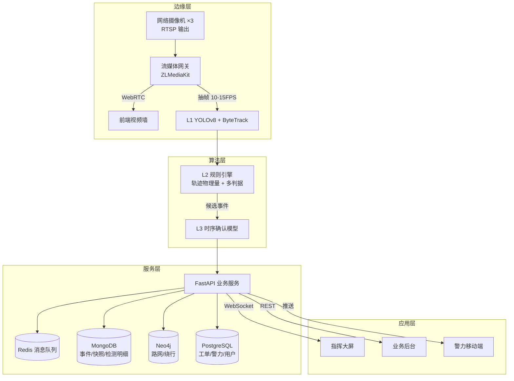

# 本科毕业设计（论文）开题报告

| 项目 | 内容 |
|------|------|
| **论文题目** | 基于深度学习的城市道路交通事故自动识别与智能派警平台设计与实现——以上海市为例 |
| **英文题目** | Design and Implementation of a Deep-Learning-Based Urban Road Traffic Accident Detection and Intelligent Dispatch Platform: A Case Study of Shanghai |
| **学生姓名** | （待填） |
| **学号** | （待填） |
| **专业/班级** | （待填） |
| **指导教师** | （待填） |
| **开题日期** | 2026 年 9 月 |

---

## 一、选题背景与意义

### 1.1 研究背景

上海市作为超大城市，截至近年机动车保有量已超 500 万辆，城市道路网总里程超过 1.8 万公里，并形成了由内环、中环、外环高架及延安高架、南北高架、沪闵高架等构成的快速路系统，以及 G2/G42(沪宁)、G50(沪渝)、G60(沪昆)、G1503(郊环)、S2(沪芦)、S32(申嘉湖) 等高速公路网络。高密度路网在带来通行便利的同时，也使交通事故的**发现与处置效率**成为影响城市交通韧性的关键环节。

当前上海交警部门的事故发现主要依赖两条路径：

1. **群众报警**——通过 110/122 电话，存在信息不完整、定位不准确、群众描述主观等问题；
2. **人工视频巡检**——值班民警在视频墙前轮巡，受限于人力与注意力，难以覆盖数百路摄像头，且长时间盯屏极易疲劳漏检。

由此产生的核心矛盾是：**监控摄像头覆盖率很高，但"看得见"与"看得懂"之间存在巨大鸿沟**。从事故发生到交警接警、派警、警力到场，往往需要数分钟甚至十余分钟，直接加剧了二次事故风险与拥堵扩散。

近年来，深度学习目标检测与多目标跟踪技术的成熟，为视频事件自动检测（Video Event Detection, VED）提供了新的技术基础。同时，云原生架构与实时 Web 技术的普及，使得"检测—上报—派警—处置"全链路自动化在工程上成为可能。

### 1.2 研究意义

**理论意义**

1. 现有交通事故检测数据集（DoTA、DADA-2000、CADP 等）绝大多数为**行车记录仪视角（ego-view）**，而实际城市监控为**路侧固定视角（surveillance-view）**，两者在目标尺度、透视畸变、背景复杂度上差异显著，存在明确的领域鸿沟（domain gap）。本研究将系统性地探索跨视角迁移方法，补充该方向的研究不足。
2. 交通事故属**小概率长尾事件**，正负样本极度不平衡。本研究将对比"有监督规则级联"与"无监督异常检测"两条技术路线在小样本条件下的表现，为同类稀缺事件检测提供方法论参考。
3. 提出并验证"感知—规则—时序确认"三级级联框架，在保证实时性的同时显著抑制误报，具有普适的工程参考价值。

**实践意义**

1. 以**误报率（FAR，次/小时）**与**平均检测延迟（MTTD）**为核心指标，直接对接产业落地需求——这是学术界较少强调但对交警业务至关重要的指标。
2. 设计"AI 建议 + 人工一键确认"的人机协同流程，兼顾自动化效率与执法责任边界，避免全自动报警带来的法律风险。
3. 构建"检测→上报→派警→处置→归档"业务闭环原型，为智慧交管系统提供可复用的架构范式。

---

## 二、国内外研究现状

### 2.1 交通事故自动检测（AID）技术演进

**（1）传统检测方法**

早期依赖物理传感器：感应线圈、微波雷达、红外检测器。其优点是稳定性高，但存在部署成本高、覆盖面有限、无法判别事故类型等固有缺陷。基于视频的早期方法则采用背景建模（高斯混合模型 GMM）、光流法、车辆轨迹突变检测等，受光照变化、阴影、天气影响较大，误报率居高不下。

**（2）深度学习方法**

随着目标检测技术突破，主流方案演进为"**检测 + 跟踪 + 判别**"范式：

- **目标检测**：YOLO 系列、Faster R-CNN、DETR 等。YOLOv8 因其速度—精度平衡良好，成为实时交通场景的首选。
- **多目标跟踪**：SORT、DeepSORT、ByteTrack、BoT-SORT、OC-SORT。ByteTrack 通过关联低分检测框显著降低 ID Switch，是当前交通场景主流选择。
- **事故判别**：可分为三条子路线
  - **规则/几何法**：基于轨迹的物理量（速度骤降、轨迹畸变、TTC 碰撞时间）设定阈值。可解释性强但阈值敏感、误报高。
  - **端到端时序分类**：SlowFast、TSN、VideoMAE 等，将事故识别建模为视频片段分类。精度有优势但计算开销大、黑盒不可解释。
  - **无监督异常检测**：MNAD、MGFN、FastAno 等，仅用正常样本训练，以重构误差或特征偏离度判定异常。适合事故样本稀缺场景。

国内研究中，交通事件检测（Traffic Incident Detection）多强调工程落地，海康、大华等厂商的视频事件检测（VED）产品已具备异常停车、逆行、抛洒物等能力，但在**车辆碰撞**这一类复杂事件上仍普遍存在误报率偏高的问题。

### 2.2 公开数据集现状

| 数据集 | 视角 | 规模与特点 |
|--------|------|-----------|
| DoTA | ego-view | 4677 段视频，含时空标注的异常区域，交通事故检测代表数据集 |
| DADA-2000 | ego-view | 2000 个事故片段，含驾驶员注意力标注与事故发生时间点 |
| CADP | ego-view | 提供事故视频与事故车图像 |
| AI City Challenge (2021 Track4 / 2022 Track3) | **surveillance-view** | 路侧摄像头视角的交通事件检测，与本课题场景最匹配 |
| CCD | 图像 | 事故车辆分类，可用于事故等级判定的辅助数据 |

**关键问题**：路侧视角的事故数据集极为稀缺，AI City Challenge 是少数可用来源，规模有限。这构成本研究必须采用**自采数据 + 跨视角迁移**策略的直接原因。

### 2.3 现有研究的不足

1. **视角错配**：算法在 ego-view 数据集上表现良好，但迁移到路侧固定视角后精度显著下降，相关研究不足。
2. **误报率被忽视**：多数论文报告 mAP、Recall 等指标，但产业实际关心的是"每小时误报多少次"（FAR）。FAR 超过 20 次/小时即无法被值班员接受。
3. **样本不平衡处理粗糙**：常见做法是简单过采样，缺乏对无监督/半监督路线的系统性对比。
4. **缺乏闭环系统研究**：多数工作止步于"检测出事件"，未打通上报、派警、处置反馈的完整链路，难以评估实际业务价值。

---

## 三、研究内容与目标

### 3.1 研究目标

面向上海市城市道路与高速公路场景，设计并实现一套**交通事故自动识别与智能派警平台**，实现：

1. 真实路侧摄像头视频流的实时接入与目标检测跟踪；
2. 交通事故（以车辆碰撞为核心）的自动识别，**检测延迟 MTTD < 5 秒，误报率 FAR < 5 次/小时/路**；
3. "AI 建议 + 人工一键确认"的警情上报流程；
4. 基于路网距离 ETA 的智能派警算法与移动端接警处置闭环。

### 3.2 研究内容

**内容一：路侧视角多目标检测与跟踪**

- 以 YOLOv8 为基础进行车辆、行人、非机动车检测；
- 采用 ByteTrack / BoT-SORT 实现稳定 ID 关联，抑制遮挡导致的 ID Switch；
- 引入全局运动补偿（RANSAC 估计背景运动）应对摄像头抖动、树影、雨雪干扰。

**内容二：三级级联交通事故识别算法（核心）**

构建"感知层 L1 — 规则层 L2 — 时序确认层 L3"的级联框架：

- **L1 感知层**：检测 + 跟踪，输出目标轨迹，推理抽帧至 10~15 FPS 以保证实时性；
- **L2 规则层**：提取轨迹物理量特征（速度 $v$、加速度 $a$、航向角 $\theta$、目标间 IoU、碰撞时间 TTC），应用多判据融合评分；
- **L3 时序确认层**：对 L2 输出的候选事件，截取时空片段送入轻量时序模型（TSM / LSTM on trajectory features）做二次确认，输出最终置信度。

**内容三：人机协同一键确认与自动上报**

设计置信度分档策略：$S \ge 0.85$ 自动置顶弹窗并支持一键确认；$0.6 \le S < 0.85$ 进入人工复核队列；$S < 0.6$ 仅留档。误报结果回写 hard-negative 样本池，形成主动学习闭环。

**内容四：智能派警算法**

以路网距离（而非欧氏距离）计算 ETA，构建多因子加权打分函数：

$$score = w_1 \cdot \frac{1}{ETA} + w_2 \cdot \frac{1}{load+1} + w_3 \cdot skillMatch + w_4 \cdot jurisdictionMatch$$

其中辖区匹配权重最高（交警严格按辖区派警）。批量场景采用匈牙利算法求全局最优。

**内容五：平台工程实现**

采用 Vue 3 + TypeScript 构建指挥大屏、业务后台与移动端；后端基于 FastAPI 提供推理调度与业务接口；使用 MongoDB（事件与快照）、Redis（实时缓存与消息队列）、Neo4j（路网拓扑与绕行计算）作为非关系型数据支撑层。

### 3.3 拟解决的关键问题

1. **路侧视角小样本条件下的模型迁移**——如何用 ego-view 数据集预训练 + 自采路侧数据微调，获得可用精度？
2. **高误报率抑制**——L3 时序确认层能带来多少 FAR 下降？各判据的贡献度如何量化？
3. **多源交叉验证**——如何利用公开交通事件数据对视觉检测结果进行外部一致性校验？

---

## 四、技术路线与实施方案

### 4.1 总体架构

### 4.2 数据采集方案

**硬件配置**

| 设备 | 型号参考 | 数量 | 用途 |
|------|---------|------|------|
| 网络摄像机 | 海康 DS-2CD3T46WDV3 级（支持 RTSP + ONVIF） | 3~4 台 | 视频源 |
| POE 交换机 | 8 口千兆 | 1 | 供电与组网 |
| 边缘算力 | RTX 3060 12G / Jetson Orin Nano | 1 | 推理 |

**点位布设原则**

- 安装高度 4~6 m，俯角 20°~30°，有效覆盖 30~50 m；
- 避免逆光：南北向道路优先选东侧或西侧机位；
- 建议 1 台顶视（碰撞检测）+ 1 台侧视（测速与轨迹）+ 1 台路口全景；
- 所有设备通过 NTP 同步时钟，保证多视角数据可对齐。

**数据构成**

| 类别 | 采集方式 | 目标规模 |
|------|---------|---------|
| 正常交通流（负样本） | 连续录制 | ≥ 10 小时 |
| 事故场景（正样本） | **合法摆拍**：遥控车碰撞、锥桶倒地、纸箱抛洒、车辆急停 | ≥ 20 次事件 |
| 补充分样本 | CARLA / SUMO + Blender 渲染路侧视角事故 | 视需要 |
| 公开数据集 | AI City Challenge、DoTA、DADA-2000 | 预训练与迁移 |

> **合规声明**：所有视频数据均来自自购设备与自有/报备场地，或公开授权数据集。不采集、不存储、不使用任何未授权摄像头内容，严格遵守《个人信息保护法》《数据安全法》及《公共安全视频图像信息系统管理条例》。

### 4.3 算法方案（核心）

**L2 规则层判据设计**

设目标 $i$、$j$ 在时刻 $t$ 的边界框为 $b_i(t)$、$b_j(t)$，速度 $v_i(t)$，航向角 $\theta_i(t)$，中心距 $d_{ij}(t)$。

① **接触判据**

$$I_{contact}(t) = \mathbb{1}\left[\text{IoU}(b_i(t), b_j(t)) > \tau_{iou}\right], \quad \tau_{iou} = 0.05$$

针对路侧视角下 bbox 重叠不显著的特性，辅以归一化中心距判据。

② **速度骤降判据**

$$\Delta v_i = \frac{\left|v_i(t^-) - v_i(t^+)\right|}{v_i(t^-) + \epsilon} > \tau_v, \quad \tau_v = 0.6$$

③ **碰撞时间 TTC 判据**

$$\text{TTC}_{ij}(t) = \frac{d_{ij}(t)}{-\dot{d}_{ij}(t)}, \quad \dot{d}_{ij} < 0$$

$$\text{TTC} < 1.5\,\text{s} \Rightarrow \text{高危接近}$$

④ **轨迹畸变判据**

$$\kappa_i(t) = \frac{\left|\theta_i(t) - \theta_i(t-\Delta t)\right|}{\Delta t} > \tau_\theta$$

**融合评分**

$$S_{collision} = \sigma\!\left(w_1 I_{contact} + w_2 \Delta v_{norm} + w_3 (1 - \text{TTC}_{norm}) + w_4 \kappa_{norm}\right)$$

权重 $w_k$ 在验证集上通过逻辑回归或网格搜索标定。

**典型误报场景与对策**

| 误报场景 | 抑制策略 |
|---------|---------|
| 行人在车流中穿插 | 引入类别先验，降低人—车接触权重 |
| 跟车过近后同时遇红灯停车 | 检查是否多目标同步减速；融合信号灯相位 |
| 大型车遮挡导致 ID 跳变 | 采用 BoT-SORT + ReID 或 OC-SORT |
| 树影、雨滴、摄像头抖动 | 光流全局运动补偿（RANSAC） |
| 路边长时间停车 | L3 时序确认 + 停留时长阈值联合判定 |

### 4.4 系统实现方案

| 层次 | 技术选型 |
|------|---------|
| 前端框架 | Vue 3.4 + Vite 5 + TypeScript |
| 状态管理 | Pinia + 持久化插件 |
| UI 组件 | Element Plus（后台）+ 自研暗色主题（大屏） |
| 地图服务 | 高德地图 JS API 2.0（`TileLayer.Traffic` 实时路况图层） |
| 图表 | ECharts 5 + vue-echarts |
| 视频播放 | WebRTC（延迟 < 500 ms）+ flv.js 降级 |
| 实时通信 | 原生 WebSocket（心跳/重连/频道订阅）+ SSE 降级 |
| 移动端 | Vue 3 + Vant 4 + PWA |
| 后端 | FastAPI + Celery/Arq |
| 数据库 | MongoDB（文档）+ Redis（缓存/队列）+ Neo4j（图）+ PostgreSQL（事务） |
| 推理部署 | Ultralytics + ONNX Runtime / TensorRT |

**坐标系处理**：摄像头/移动端 GPS 采集为 WGS84，高德地图使用 GCJ-02，两者偏移约 300~600 m，需在共享工具包中封装双向转换函数。

---

## 五、关键技术与创新点

### 5.1 关键技术创新

**创新点 1：面向路侧视角的"感知—规则—时序确认"三级级联检测框架**

不同于端到端黑盒模型，该框架实现精度、实时性与可解释性的三方平衡：L1 保证速度、L2 保证可追溯（每条判据可审计，是交警采信的前提）、L3 保证精度。同时，三级结构天然支持**逐级消融实验**，便于量化各层贡献。

**创新点 2：跨视角迁移 + 自采小样本微调的数据策略**

系统性地解决 ego-view 公开数据与 surveillance-view 应用场景之间的领域鸿沟，并通过合法摆拍补足长尾事故样本。将主动学习闭环（误报回写）纳入数据迭代流程。

**创新点 3：以 FAR 为核心优化目标的工程化评价体系**

突破学术界以 mAP 为主导的评价惯性，将"每小时误报次数"作为核心指标，并同步报告 MTTD、漏检率、FPS 与显存占用，形成面向落地的多维度评价。

**创新点 4：检测—上报—派警闭环与人机协同机制**

设计置信度分档 + 一键确认 + 误报回写的完整业务闭环，兼顾自动化效率与执法责任边界。

### 5.2 关键技术难点

1. 路侧视角下小目标（远距离车辆）检测精度不足；
2. 事故样本极度稀缺，正负样本比例可能超过 1:10000；
3. 规则阈值在不同点位、不同光照下的泛化性；
4. 多路视频并发下的推理算力调度与实时性保障。

---

## 六、实验设计与评价指标

### 6.1 数据集划分

| 集合 | 来源 | 用途 |
|------|------|------|
| 预训练集 | DoTA + DADA-2000（ego-view） | 特征预训练 |
| 训练集 | AI City Challenge + 自采事故片段 | 模型训练 |
| 验证集 | 自采数据，按点位划分 | 阈值与权重标定 |
| 测试集 | 自采数据，**按时间划分**（避免数据泄漏） | 最终评测 |

### 6.2 对比方法

| 编号 | 方法 | 说明 |
|------|------|------|
| M1 | 纯 YOLO（无跟踪） | 基线 |
| M2 | YOLO + ByteTrack（L1） | 感知基线 |
| M3 | YOLO + 规则（L1 + L2） | 规则基线 |
| **M4** | **YOLO + 规则 + 时序确认（L1+L2+L3）** | **本文方法** |
| M5 | SlowFast / VideoMAE 端到端 | 深度学习对比基线 |
| M6 | MNAD / MGFN 无监督异常检测 | 小样本对比基线 |

### 6.3 评价指标

**检测精度类**

$$\text{Precision} = \frac{TP}{TP+FP}, \quad \text{Recall} = \frac{TP}{TP+FN}, \quad F_1 = \frac{2PR}{P+R}$$

**工程落地类（核心）**

- **FAR（False Alarm Rate）**：误报次数/小时/路，目标 < 5；
- **MTTD（Mean Time To Detect）**：从事故发生到系统告警的平均延迟，目标 < 5 s；
- **漏检率**：$1 - \text{Recall}$，事故漏检后果严重，需重点关注。

**性能类**

- 推理帧率 FPS、单路显存占用、端到端时延（采集→告警）。

**系统类**

- 视频墙并发路数、WebSocket 消息延迟、派警 ETA 计算耗时。

### 6.4 消融实验设计

| 实验 | 变量 | 目的 |
|------|------|------|
| A1 | 逐一移除 $I_{contact}$ / $\Delta v$ / TTC / $\kappa$ | 证明每条判据必要性 |
| A2 | 有无 L3 时序确认层 | 量化 L3 对 FAR 的抑制效果 |
| A3 | 阈值 $\tau$ 扫描 | 绘制 FAR–Recall 权衡曲线 |
| A4 | 有/无 ego-view 预训练 | 量化跨视角迁移收益 |
| A5 | 有/无全局运动补偿 | 量化抖动抑制效果 |

### 6.5 结果呈现形式

- 对比方法性能总表（含 FAR、MTTD）
- PR 曲线、FAR–Recall 权衡曲线
- 混淆矩阵与典型误报案例可视化分析
- 系统界面截图与端到端演示视频

---

## 七、开发进度安排

| 阶段 | 时间 | 主要任务 | 交付物 |
|------|------|---------|--------|
| M0 | 第 1 周 | 设备采购、RTSP 拉流与 WebRTC 转发链路打通 | 可播放的视频墙 Demo |
| M1 | 第 2 周 | 正常交通流录制（≥10h）+ 合法摆拍事故场景（≥20 次） | 自采数据集 v1 |
| M2 | 第 3 周 | YOLOv8 + ByteTrack 跑通，轨迹特征提取管线 | L1 模块 |
| M3 | 第 4~5 周 | L2 规则引擎实现 + 碰撞检测判据调优 + FAR 评测 | L2 模块 + 初步指标 |
| M4 | 第 6~7 周 | L3 时序模型训练 + 完整消融实验（A1~A5） | 核心实验结果 |
| M5 | 第 8 周 | 后端事件服务 + 一键确认流程 + 上报适配器 | 后端 API |
| M6 | 第 9~10 周 | Vue 指挥大屏（视频墙 + 地图态势 + 告警弹窗） | 前端大屏 |
| M7 | 第 11 周 | 移动端接警处置 + 端到端联调 | 移动端 |
| M8 | 第 12~13 周 | 论文撰写、指标复核、答辩演示准备 | 论文终稿 |

**关键路径提示**：M1 数据采集是最大风险点（真实事故不可控），建议设备到货同步启动 L2 规则引擎编码，用公开视频先行验证逻辑。

---

## 八、预期成果

1. **一套可运行的事故自动识别与派警平台原型**，包含指挥大屏、业务后台、移动端三端；
2. **一个自采的路侧视角交通事故数据集**（含 ≥10h 正常样本与 ≥20 次事故事件），可供后续研究使用；
3. **一套三级级联事故检测算法**及其完整消融实验数据；
4. **一份毕业设计论文**，以及系统源码、演示视频与用户文档。

---

## 九、可行性分析

| 维度 | 分析 |
|------|------|
| **技术可行性** | YOLOv8、ByteTrack 已有成熟开源实现；三级级联框架中的规则层与接口层无技术障碍；时序模型可选用参数量小的 TSM/轻量 3D-CNN，消费级 GPU 可训练。 |
| **数据可行性** | 正常样本可通过自建摄像头长时间录制获得；事故正样本通过合法摆拍可控生成；公开的 AI City Challenge / DoTA / DADA-2000 可作预训练与对比基线。 |
| **硬件可行性** | 3~4 台网络摄像机 + 中端 GPU 的总成本在可承受范围内；若预算受限可缩减至 2 台。 |
| **合规可行性** | 全部视频数据源自主购设备与公开授权数据集，不涉及任何未授权摄像头内容，符合现行法律法规。 |
| **进度可行性** | 13 周排期已预留缓冲；核心算法模块可与硬件采购并行推进。 |

**主要风险与应对**

| 风险 | 影响 | 应对措施 |
|------|------|---------|
| 摄像头到货延迟 | 阻塞数据采集 | 先用公开数据集开发算法逻辑，硬件到货后直接接真实流 |
| 自采事故样本不足 | 模型欠拟合 | 增加数字孪生合成样本；引入无监督异常检测路线作为补充 |
| 误报率不达标 | 系统不可用 | 强化 L3 时序确认层；引入多帧投票与多源交叉验证机制 |
| 算力不足 | 无法支持多路并发 | 降低推理帧率与输入分辨率；采用模型量化与 TensorRT 加速 |

---

## 十、参考文献

> ⚠️ 以下文献为方向性参考，**提交前请务必通过 CNKI / IEEE Xplore / Google Scholar 核实作者、年份、卷期页码等完整信息**，并按学校要求的格式（GB/T 7714）统一整理。

**目标检测与跟踪**

[1] Redmon J, Divvala S, Girshick R, et al. You Only Look Once: Unified, Real-Time Object Detection[C]// CVPR, 2016.
[2] Jocher G, et al. Ultralytics YOLOv8[CP/OL]. https://github.com/ultralytics/ultralytics, 2023.
[3] Zhang Y, Sun P, Jiang Y, et al. ByteTrack: Multi-Object Tracking by Associating Every Detection Box[C]// ECCV, 2022.
[4] Aharon N, Orfaig R, Bobrovsky B Z. BoT-SORT: Robust Associations Multi-Pedestrian Tracking[J]. arXiv:2206.14651, 2022.
[5] Cao J, Pang J, Weng X, et al. Observation-Centric SORT: Rethinking SORT for Robust Multi-Object Tracking[C]// CVPR, 2023.

**交通事故检测与数据集**

[6] Wu P, Chen X, Guo R, et al. DoTA: Unsupervised Detection of Traffic Anomaly in Driving Videos[J]. IEEE TPAMI, 2023.
[7] Fang J, Yan D, Qiao J, et al. DADA-2000: Can Driving Accident be Predicted by Driver Attention?[C]// ITSC, 2019.
[8] Shah A P, Lamare J B, Nguyen-Anh T, et al. CADP: A Novel Dataset for CCTV Traffic Accident Detection[C]// AVSS, 2018.
[9] Naphade M, Wang S, Anastasiu D C, et al. The 6th AI City Challenge[C]// CVPR Workshops, 2022.

**时序建模与异常检测**

[10] Feichtenhofer C, Fan H, Malik J, et al. SlowFast Networks for Video Recognition[C]// ICCV, 2019.
[11] Tong Z, Song Y, Wang J, et al. VideoMAE: Masked Autoencoders are Data-Efficient Learners for Self-Supervised Video Pre-Training[C]// NeurIPS, 2022.
[12] Liu W, Luo W, Lian D, et al. Future Frame Prediction for Anomaly Detection — A New Baseline[C]// CVPR, 2018.
[13] Park H, Noh J, Ham B. Learning Memory-Guided Normality for Anomaly Detection[C]// CVPR, 2020.
[14] Chen Y, Liu Z, Zhang B, et al. MGFN: Magnitude-Contrastive Glance-and-Focus Network for Weakly-Supervised Video Anomaly Detection[C]// AAAI, 2023.

**中文文献**

[15] 交通事件自动检测相关综述（请在 CNKI 检索"交通事件检测""交通事故识别"等关键词补充 3~5 篇近年中文核心期刊文献）
[16] 智能交通系统与视频事件检测相关学位论文（建议检索近三年同类课题，用于对比与引用）

---

## 附录：选题确认要点

| 确认项 | 结论 |
|--------|------|
| 答辩重点 | **AI 事故识别算法**（约占 50% 工作量） |
| 视频源 | **真实网络摄像头**（自购设备，RTSP 接入） |
| 移动端 | **需要**（Vue 3 + Vant 4 + PWA） |
| 上报策略 | **AI 建议 + 人工一键确认**（非全自动派警） |
| 地理范围 | 上海市（路网、行政区划、实时路况均基于上海） |
| 数据合规 | 仅使用自采设备与公开授权数据集，不触碰未授权摄像头 |
